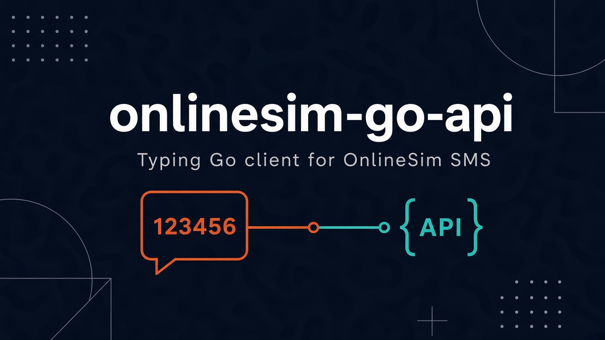

[](https://github.com/s00d/onlinesim-go-api/actions/workflows/ci.yml)
[](https://pkg.go.dev/github.com/s00d/onlinesim-go-api/v2)
[](https://github.com/s00d/onlinesim-go-api/wiki)
[](https://github.com/s00d/onlinesim-go-api/issues)
[](https://github.com/s00d/onlinesim-go-api/stargazers)
[](https://www.donationalerts.com/r/s00d88)

<p align="center">
  
</p>

# onlinesim-go-api

Go client for the [OnlineSim](https://onlinesim.io) SMS API with typed models, `context`-aware methods, and a built-in HTTP mock for tests — no real numbers required.

Guides and API examples: [GitHub Wiki](https://github.com/s00d/onlinesim-go-api/wiki).

## Install

```bash
go get github.com/s00d/onlinesim-go-api/v2
```

```go
import onlinesim "github.com/s00d/onlinesim-go-api/v2"
```

For the reusable mock (tests / offline integration):

```go
import "github.com/s00d/onlinesim-go-api/v2/mock"
```

## Quick start

```go
package main

import (
	"context"
	"fmt"

	onlinesim "github.com/s00d/onlinesim-go-api/v2"
)

func main() {
	client := onlinesim.New("your-apikey")
	balance, err := client.User().Balance(context.Background())
	if err != nil {
		panic(err)
	}
	fmt.Println("balance =", balance.Balance)

	tzid, err := client.Numbers().Get(context.Background(), onlinesim.GetNumberParams{
		Service: "telegram",
	})
	if err != nil {
		panic(err)
	}
	fmt.Println("tzid =", tzid)
}
```

### Client options

| Option | Description |
|--------|-------------|
| `WithLang` | Locale (`en` / `ru`) |
| `WithDevID` | Developer id |
| `WithOAuth` | OAuth bearer token |
| `WithBaseURL` | Override API base (also used with mock) |
| `WithHTTPClient` | Custom `*http.Client` |
| `WithRateLimit` | Requests per second (default `1`; `0` disables). `setOperationOk` is also paced ≤1 / 5s |
| `WithUserAgent` | Custom User-Agent |
| `WithTimeout` | Timeout for the default HTTP client |

```go
client := onlinesim.New("your-apikey",
	onlinesim.WithLang("en"),
	onlinesim.WithDevID(123),
)
```

## Webhooks

OnlineSim can `POST` JSON to your URL when an SMS arrives (temporary numbers and rent).

```go
client := onlinesim.New("your-apikey")
url := "https://example.com/hooks/sms"
_ = client.User().SetWebhookURL(context.Background(), &url)

body := []byte(`{"user_id":1,"country_code":1,"number":"+19001234567","sender":"Telegram","message":"code 123456","time_start":"2026-01-01 00:00:00","time_left":10,"operation_id":1000,"webhook_type":"receiving_sms","code":"123456"}`)
payload, err := onlinesim.ParseWebhookJSON(body)
if err != nil {
	panic(err)
}
fmt.Println(payload.Code)
```

Respond with **HTTP 200**. Fields may be numbers or strings; `{ "data": { … } }` wraps are accepted.

| Method | Purpose |
|--------|---------|
| `User().SetWebhookURL(&url)` | Enable / change webhook |
| `User().ClearWebhookURL()` | Disable |
| `User().WebhookLogs(page)` | Delivery history |
| `ParseWebhookJSON` | Parse inbound POST body |

## Built-in mocks (no real numbers)

```go
m := mock.Start()
defer m.Close()
m.ScriptSMS(mock.SmsScript{
	Service:         "telegram",
	Code:            "123456",
	PollsBeforeCode: 1,
})

client := m.Client()
ordered, _ := client.Numbers().GetWithNumber(context.Background(), onlinesim.GetNumberParams{Service: "telegram"})
code, _ := client.Numbers().WaitCode(context.Background(), ordered.Tzid, onlinesim.WaitCodeOptions{
	Interval:    0, // no sleep in tests
	MaxAttempts: 5,
})
fmt.Println(code)
```

```bash
go run ./examples/mock_sms_flow
```

### Mock helpers

| Method | Purpose |
|--------|---------|
| `ScriptSMS(SmsScript)` | Queue number + SMS code delivery |
| `FailNoNumber(service)` | Force `NO_NUMBER` on `getNum` |
| `SetBalance(...)` | Control `getBalance` |
| `NewBuilder().StatePath(...)` | Persist balance/ops across restarts |
| `Client()` | Preconfigured client pointed at the mock |

## API modules

| Access | Module |
|--------|--------|
| `client.Numbers()` | Temporary SMS numbers, `WaitCode`, tariffs |
| `client.Rent()` | Long-term number rent |
| `client.User()` | Balance / profile / payments / webhooks |
| `client.Free()` | Public free numbers |

Default country dial code is **`7`** (`DefaultCountry`) when `Country` is omitted.

## Examples

```bash
ONLINESIM_APIKEY=... go run ./examples/balance
ONLINESIM_APIKEY=... go run ./examples/wait_sms
go run ./examples/mock_sms_flow
```

## Testing

HTTP tests use the same published [`mock`](https://pkg.go.dev/github.com/s00d/onlinesim-go-api/v2/mock) package that downstream modules import.

```bash
go test ./... -race
```

## License

Apache License 2.0
